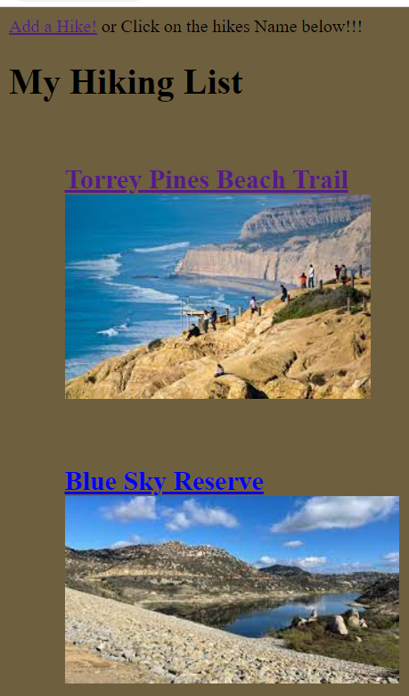
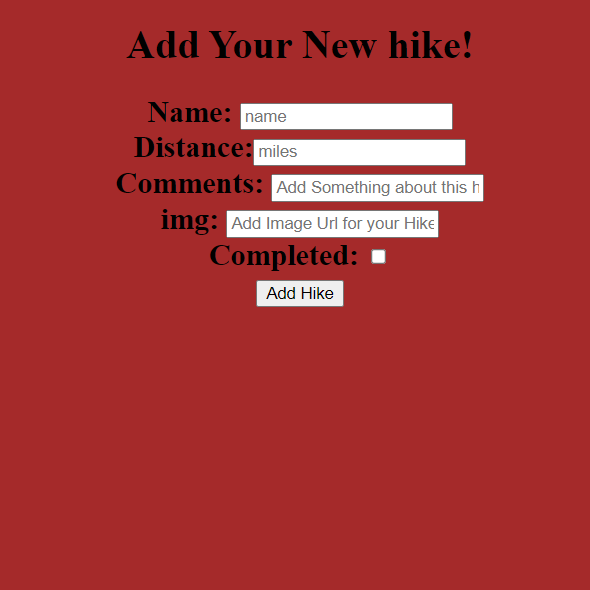
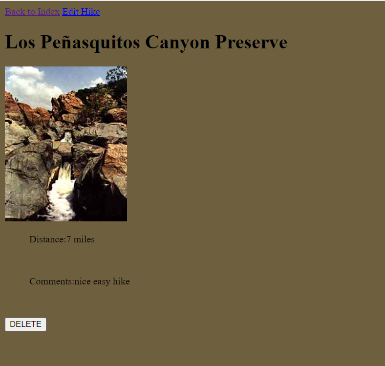

#Title
_**My Hiking App**_
Have you ever wanted a page to show off where you have hiked!
Look no further with "My Hiking App" 
You will be able to Log all your hikes along with pictures, distances, and even your own Comment!
---

#Trello Board & App link

[Trello Board!](https://trello.com/b/dPlSeAOk/hiking-app)
[Open the Hiking App!](https://newbodymain.herokuapp.com/hikes)
---

### Routes

| Name | Method | Endpoint | Description |
| ----- | ------- | ------- | ----------- |
| Index | GET | /hikes | Displays the model list of hikes
| New | GET | /hikes/new | Displays a form to create a new hike
| Create | POST | /posts | Adds a new hike and redirects to the Index
| Show | GET | /hikes/:id | Displays a single post with comments/answers
| Edit | GET | /hikes/:id/edit | Displays a form to edit the hikes.
| Update | PUT | /hikes/:id | Updates the post with the Edit form data and redirects to index
| Destroy | DELETE | /hikes/:id | Deletes the hike and redirects to the index
---

#### Dependencies

-Express
-EJS
-Mongoose
-Method-Override
-dotenv
---

### ScreenShots

### Future Goals

-will be to update the CSS 
-Add Auth
-Add a friends list
-Make Groups so users can coordinate hikes